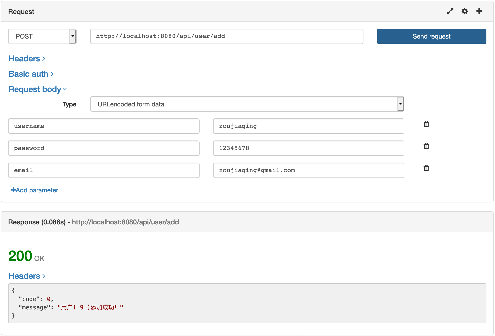
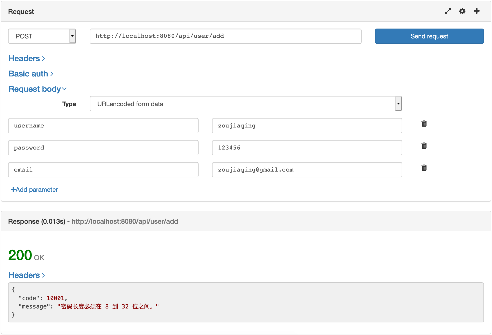

# 基于 Hunt Framework 快速创建项目

`Hunt Framework` 是使用 D语言开发的全栈 Web 框架，类似于 Laravel / SpringBoot / Django 等，可以让 D 语言开发者快速的创建项目，内置超多业务规范一是方便开发者开箱即可用，二是方便管理者对项目代码更容易 review。

本示例代码基于目前最新的 `Hunt Framework` 最新版本 `3.2.0` 进行编写，接下来让我们感受一下使用 DLang 开发的快感：）

## 1. 创建一个普通的模板页面渲染项目
### 1.1 基于骨架项目创建空项目

首先使用 `git` 命令把骨架项目克隆到本地。

```bash
git clone https://github.com/huntlabs/hunt-skeleton.git myproject
cd myproject
```

### 1.2 修改项目 http 监听地址和 监听端口

http 相关配置项在 `config/application.conf` 中可以找到如下内容，我们监听的 ip 是 `127.0.0.1` 端口是 `8080`：
```conf
http.address = 127.0.0.1
http.port = 8080
```

### 1.3 控制器
我们可以看到 `source/app/controller/IndexController.d` 的源码，这个就是一个普通的控制器，代码如下：
```D
module app.controller.IndexController;

import hunt.framework;

class IndexController : Controller
{
    mixin MakeController;

    @Action
    string index()
    {
        return view.render("index");
    }
}
```
我们可以看到 `index` 控制器还有一个 `index` 的方法，这个方法被使用 @Action 标记为了可访问的页面，而这个页面又使用 view 视图渲染了 `index.html` 模板（这里模板的扩展名因安全问题被省略）。

这里的视图会渲染 `resources/views/default/index.html` 模板文件。

### 1.4 路由配置
在配置文件目录可以找到 `config/routes` 这个默认的路由配置表，骨架项目有一条记录如下：
```conf
GET    /    index.index
```
这条语义是使用 `GET` 方法访问 `/` 这个 path 会映射到 `index` 控制器的 `index` 方法。

### 1.5 编译运行项目
整个项目使用 `dub` 包管理器管理，一个命令即可编译运行：
```sh
dub run -v
```
这时候根据你自己配置的 ip 和 端口访问即可：
```text
http://127.0.0.1:8080
```

至此你的 D 语言项目就跑起来了，是不是很酷？😎那下面章节来点数据库操作。

## 2 创建一个增删改查的 API 项目
在创建增删改查 API 之前我们需要做一些准备工作，一是创建好数据库的表结构，二是开启框架的路由组支持，让用户可以通过 `example.com/api` 或 `api.example.com` 的形式可以访问到。

### 2.1 首先我们开启路由组
在 `config/application.conf` 找到配置项 `route.groups` 修改为：
```conf
route.groups = api:path:api
```
那我这里解释一下 api:path:api 的含义，{路由组的KEY}:{访问路由组的方式}:{路由组的自定义值}，那通过上面这个设置后我们的 api 访问地址前缀就应该是：
```text
http://127.0.0.1:8080/api
```
如果我们设置为 `route.groups = api:domain:api.example.com` 那我们访问 api 地址的前缀就是：
```text
http://api.example.com/
```

### 2.2 我们的表结构设计
可以自己执行这个 SQL 创建表，我们数据库使用的是 MySQL 5.7.x 做的 example。

```SQL

SET NAMES utf8mb4;
SET FOREIGN_KEY_CHECKS = 0;

-- ----------------------------
-- Table structure for my_user
-- ----------------------------
DROP TABLE IF EXISTS `my_users`;
CREATE TABLE `my_users` (
  `id` bigint(20) NOT NULL AUTO_INCREMENT,
  `username` varchar(255) DEFAULT NULL,
  `password` varchar(255) DEFAULT NULL,
  `email` varchar(255) DEFAULT NULL,
  `created` bigint(11) DEFAULT NULL,
  `updated` bigint(11) DEFAULT NULL,
  PRIMARY KEY (`id`)
) ENGINE=InnoDB DEFAULT CHARSET=utf8mb4;

SET FOREIGN_KEY_CHECKS = 1;
```

### 2.3 修改数据库相关配置文件

数据库配置项文件在 `config/application.conf` 进行修改，找到如下配置按照你自己本地数据库环境进行设置：
```conf
# Database
database.driver = mysql
database.host = 127.0.0.1
database.port = 3306
database.database = myproject
database.username = root
database.password = 123456
database.charset = utf8
database.prefix = my_
database.enabled = true
```

### 2.4 创建数据库模型

`Hunt Framework` 也是内置 `Model` 模型，我们创建模型类 `app/model/User.d`：

```D
module app.model.User;

import hunt.entity;

@Table("users")
class User : Model
{
    mixin MakeModel;

    @AutoIncrement
    @PrimaryKey
    ulong id;

    string username;
    string password;
    string email;
    
    uint created;
    uint updated;
}
```

要注意的是使用 `@PrimaryKey` 标记 `id` 为主键，并且使用 `@AutoIncrement` 标记为自增，`@Table("users")` 是让你自己填写自己表的真实名字，我们表的真实名是 `my_users`，因为所有表前缀已经在 `config/application.conf` 中的配置项 `database.prefix = my_` 配置过，所以这里的值我们只需要写 `users` 即可。

### 2.5 创建 Repository 对象
这个对象只要继承 `EntityRepository` 即可，里边已经包含了很多丰富的操作方法，`app/repository/UserRepository.d`：
```D
module app.repository.UserRepository;

import hunt.framework;

import app.model.User;

class UserRepostiroy : EntityRepository!(User, ulong)
{

}
```
这里我们自定义 `UserRepository` 继承的 `EntityRepository` 是 `hunt-entity` 这个 ORM 库自带的类，我们使用模板传值的方式将我们自定义的 Model 类 `User` 和主键类型 `ulong` 传递过去了，这个编译时会帮我们处理很多事情，我们只要记住如何写就好了。

### 2.6 创建表单验证的类
作为 API 就很难缺少 POST 表单的接收和验证，`Hunt Framework` 内置表单验证机制，我们需要自己实现一个表单验证的对象 `app/form/UserForm.d`：
```D
module app.form.UserForm;

import hunt.framework;

class UserForm : Form
{
    mixin MakeForm;

    @Length(4, 30, "用户名长度必须在 {{min}} 到 {{max}} 位之间。")
    string username;

    @Length(8, 32, "密码长度必须在 {{min}} 到 {{max}} 位之间。")
    string password;
    
    @NotEmpty("Email地址不允许为空。")
    string email;
}
```

### 2.7 创建 API 对应的控制器
因为我们 API 使用的是独立的路由组，所以我们创建控制器的时候需要在 `app/controller/` 目录下再创建一个子目录 `api` 来保存对应的控制器类文件，所以我们这个类文件命名为 `app/controller/api/UserController.d`：
```D
module app.controller.api.UserController;

import hunt.framework;

import app.repository.UserRepostiroy;
import app.model.User;
import app.message.ResultMessage;
import app.form.UserForm;

class UserController : Controller
{
    mixin MakeController;

    @Action
    Response add(UserForm form)
    {
        // ResultMessage 是要返回的 json 消息体
        auto resultMessage = new ResultMessage;

        // 使用 valid() 方法获取一个校验结果对象
        auto valid = form.valid();
        if (!valid.isValid())
        {
            // 给个错误码
            resultMessage.code = 10001;

            // valid.messages() 方法可以获取所有错误信息，我们这里只简单的获取一个错误进行返回
            foreach (message; valid.messages())
            {
                resultMessage.message = message;
                break;
            }
        }
        else
        {
            auto repository = new UserRepository;

            auto user = new User;
            user.username = form.username;
            user.password = form.password;
            user.email = form.email;

            // 把模型数据保存到数据库
            repository.save(user);

            // 因没有错误就不需要设置错误码，提示添加成功即可
            import std.format : format;

            resultMessage.message = format!"用户( %d )添加成功！"(user.id);
        }

        // 返回结果对象会自动由 JsonResponse 序列化为 json 返回给客户端
        return new JsonResponse(resultMessage);
    }
}
```

这里是 ReusltMessage 的代码：
`app/message/ReusultMessage.d`
```D
module app.message.ResultMessage;

class ResultMessage
{
    uint code = 0;
    string message;
}
```

### 2.8 API 路由配置文件
每个路由组有自己的路由配置表，`api` 的路由配置表是 `config/api.routes`，这个规则是不是很简单？我们看看添加用户接口的路由配置项：
```conf
POST    /user/add    user.add
```
是不是很简单？这里因为是 `api.routes` 所以控制器会在 `app/controller/api/` 目录下找对应的 `user` 控制器和 `add` 方法。

### 2.9 测试添加用户接口
这里我们使用 Firefox 插件进行接口请求，我们按照表单的要求添加 3 个字段，分别为 `username`、`password`、`email`，我们也按照 `UserForm` 中的验证规则去填写，当我们提交表单的时候可以看到如下界面：

这里提示 `用户( 9 )添加成功！`，这里的数字 `9` 其实是我们在将用户数据写入库中以后返回的主键 ID。

那我们为了测试表单校验的作用，我们把密码从 8 位改为 6 位，因为我们在 `UserForm` 中规则设定的是 8~32 位之间，再次提交表单如下结果：


这里说明我们的表单校验已经起了作用：）

### 3 总结
最总完成的项目目录结构如下：
```text
MYRPOJECT/
├── config
│   ├── api.routes
│   ├── application.conf
│   └── routes
├── data
│   └── mysql.sql
├── dub.sdl
├── resources
│   ├── translations
│   │   ├── en-us
│   │   │   └── message.ini
│   │   └── zh-cn
│   │       └── message.ini
│   └── views
│       └── default
│           ├── footer.html
│           ├── header.html
│           └── index.html
├── source
│   ├── app
│   │   ├── controller
│   │   │   ├── IndexController.d
│   │   │   └── api
│   │   │       └── UserController.d
│   │   ├── form
│   │   │   └── UserForm.d
│   │   ├── message
│   │   │   └── ResultMessage.d
│   │   ├── model
│   │   │   └── User.d
│   │   └── repository
│   │       └── UserRepository.d
│   └── main.d
└── wwwroot
    └── favicon.ico
```

整个项目看下来也算是清晰明了，在框架的使用方式上有着熟悉的味道，`Hunt Framework` 有着像 `Laravel` 那么快的开发效率，也有像 `SpringBoot` 那样规范的数据库操作方式，也具有像 `golang` 一样有原生语言编译后方便的部署方式。
